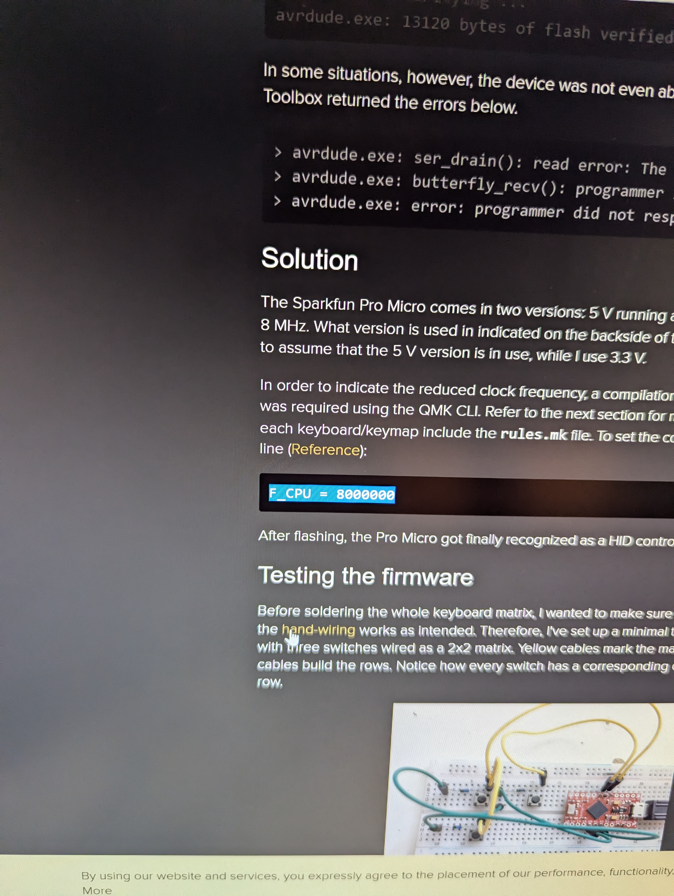

I have been trying and trying to get my ProMicro to work with QMK, I even went as far as to try it on Windows, but without any joy!! 

just as I was shutting down Windows I spotted a page that looked promising, but I had alreay pressed shutdown. so took a quick photo of the important bit.

turns out because I needed a 3.3v promicro the clock fequency was wrong. 

adding "F_CPU = 8000000" fixed it... happy days!!! now to resolder everything :smile: 
